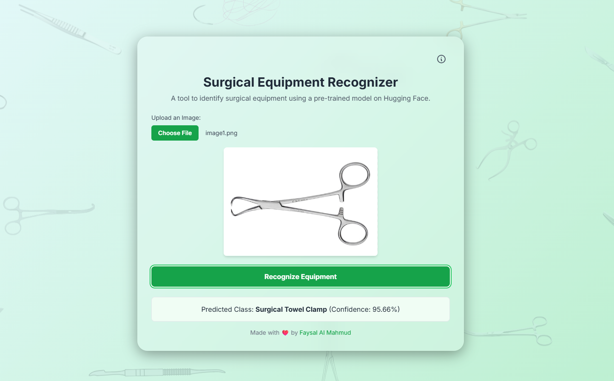
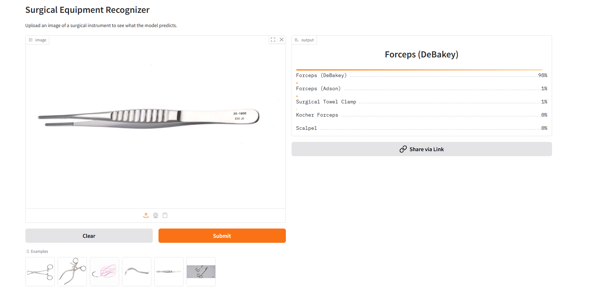

# Surgical Equipment Recognizer

An AI-powered tool that can identify and classify 20 different types of surgical equipment using deep learning. Built with FastAI and deployed as a Gradio App on Hugging Face Spaces.


[](https://huggingface.co/spaces/faysalalmahmud/surgical-equipment-recognizer)
[](https://faysalalmahmud.github.io/surgical-equipment-recognizer/)

## 🎯 Overview

This project uses computer vision to automatically identify surgical equipment from images. It can recognize 20 different types of commonly used surgical instruments with high accuracy, making it useful for medical education, inventory management, and training purposes.

## 🔧 Recognized Equipment

The model can identify the following 20 surgical instruments:

| Equipment                        | Description                                   |
| :------------------------------- | :-------------------------------------------- |
| **Scalpel**                      | Sharp surgical knife for making incisions     |
| **Surgical Scissors (Mayo)**     | Heavy-duty scissors for cutting tough tissues |
| **Metzenbaum Scissors**          | Delicate scissors for fine tissue dissection  |
| **Forceps (Adson)**              | Precision forceps with fine teeth             |
| **Forceps (DeBakey)**            | Atraumatic forceps for delicate tissues       |
| **Hemostat**                     | Clamps for controlling bleeding               |
| **Needle Holder**                | Instrument for holding suture needles         |
| **Retractor (Deaver)**           | Tool for holding back tissues                 |
| **Surgical Towel Clamp**         | Clamps for securing drapes                    |
| **Suction Tip (Frazier)**        | Suction device for fluid removal              |
| **Surgical Stapler**             | Device for closing wounds with staples        |
| **Bone Saw**                     | Saw for cutting through bone                  |
| **Rongeur**                      | Forceps for removing bone and tissue          |
| **Curette**                      | Spoon-shaped instrument for scraping          |
| **Suture**                       | Thread material for wound closure             |
| **Retractor (Gelpi)**            | Self-retaining tissue retractor               |
| **Kocher Forceps**               | Toothed forceps for grasping tissues          |
| **Allis Clamp**                  | Atraumatic clamp with multiple teeth          |
| **Bovie (Electrosurgical Unit)** | Electrocautery device                         |
| **Laparoscope**                  | Camera for minimally invasive surgery         |

## 🚀 Live Application

- **🌐 Web App**: [GitHub Pages](https://faysalalmahmud.github.io/surgical-equipment-recognizer/)
- **🤗 Hugging Face**: [Interactive Gradio App](https://huggingface.co/spaces/faysalalmahmud/surgical-equipment-recognizer)

### Application Screenshot

<br>
<i>The GitHub Pages application successfully identifying a Surgical Towel Clamp with 95.66% confidence</i>

<br>

<br>
<i>The HuggingFace space's Gradio application successfully identifying a Forceps (DeBakey) with 98% confidence</i>

## 🛠️ Technical Implementation

### Model Architecture

- **Base Models Tested**: ResNet50, EfficientNet-b1, DenseNet121
- **Best Performing Model**: DenseNet121 (fine-tuned with 5 epochs)
- **Framework**: FastAI
- **Transfer Learning**: Pre-trained models fine-tuned on surgical equipment dataset

### Data Collection & Preprocessing

- **Data Source**: DuckDuckGo Image Search API
- **Dataset Size**: A total of **5,961** images were scraped for all 20 equipment categories. After cleaning, the final dataset contains **5,022** images.
- **Data Cleaning**: Manual review and cleaning of collected images using FastAI's `ImageClassifierCleaner`.
- **Augmentation**: FastAI's built-in data augmentation techniques
- **Detailed Process**: See `notebooks/data_prep.ipynb` for complete data collection and preprocessing workflow

### Model Training Process

1.  **Initial Training (v0)**: Fine-tuned pre-trained models on the original dataset.
2.  **Data Cleaning**: Identified and removed mislabeled/poor quality images.
3.  **Retraining (v1)**: Trained the models again on the cleaned dataset.
4.  **Model Selection**: DenseNet121 (v1) achieved the best performance after cleaning.
5.  **Detailed Process**: Complete training workflow and data cleaning steps documented in `notebooks/training_&_data_cleaning.ipynb`

### Deployment

- **Backend**: Gradio interface
- **Cloud Hosting**: Hugging Face Spaces
- **Web Interface**: GitHub Pages (using HF Spaces API)

## 📊 Model Performance

### Model Benchmarks

Here is a comparison of the model accuracies before (v0) and after (v1) data cleaning.

| Model Name      | V0 (Before Data Cleaning) | V1 (After Data Cleaning) |
| :-------------- | :------------------------ | :----------------------- |
| ResNet50        | 85%                       | 83%                      |
| EfficientNet-b1 | 77%                       | 81%                      |
| DenseNet121     | 88%                       | **86%**                  |

The final DenseNet121 model achieved the best results among the models tested after data cleaning:

- **Overall Accuracy**: 86%
- High accuracy across all 20 equipment categories
- Robust performance on real-world surgical equipment images
- Fast inference time suitable for real-time applications

## 🔧 Installation & Usage

### Local Setup

1.  Clone the repository:

    ```bash
    git clone [https://github.com/faysalalmahmud/surgical-equipment-recognizer.git](https://github.com/faysalalmahmud/surgical-equipment-recognizer.git)
    cd surgical-equipment-recognizer
    ```

2.  Install dependencies:

    ```bash
    pip install fastai gradio
    ```

3.  Run the Gradio app locally:
    ```bash
    python app.py
    ```

### Using the Web Interface

1.  Visit the [live app](https://faysalalmahmud.github.io/surgical-equipment-recognizer/)
2.  Upload an image of surgical equipment
3.  Get instant predictions with confidence scores

### API Usage

You can also use the Hugging Face Spaces API. Here's how to integrate it into your applications:

**JavaScript**

```javascript
import { Client } from "@gradio/client";

const client = await Client.connect(
  "faysalalmahmud/surgical-equipment-recognizer"
);
const result = await client.predict("/predict", {
  image: exampleImage,
});

console.log(result.data);
```

**Python**

```python
from gradio_client import Client

client = Client("faysalalmahmud/surgical-equipment-recognizer")
result = client.predict(
    "path/to/your/image.jpg",  # str (filepath or URL to image)
    api_name="/predict"
)
print(result)
```

## 📁 Project Structure

```
surgical-equipment-recognizer/
├── README.md                      # Project documentation
├── LICENSE                        # Project license
│
├── 📁 data/                     # Dataset
│   └── README.md
│
├── 📁 dataloaders/              # Data loaders
│   ├── README.md
│   ├── surgical_equipment_dataloader_v0.pkl
│   └── surgical_equipment_dataloader_v1.pkl
│
├── 📁 deployment/                # Deployment files
│   ├── app.py                     # Gradio application
│   ├── gradio_app.png             # App screenshot
│   ├── README.md
│   ├── requirements.txt           # Python dependencies
│   ├── example_images           # Example images folder
|   └── surgical_equipment_recognizer_model_v1.pkl        #Deployed Densenet121 model
│
├── 📁 docs/                      # GitHub Pages files
|   ├── background.png             # Background imgae used on  github pages 
│   ├── github_pages.png           # GitHub Pages screenshot
│   ├── index.html                 # Web interface
│   └── script.js                  # JavaScript functionality
│
├── 📁 models/                     # Trained models
│   └── README.md
│
└── 📁 notebooks/                 # Data Preperation, Model Training & Inference notebooks
    ├── data_prep.ipynb            # Data preparation
    ├── inference.ipynb            # Model inference
    └── training_&_data_cleaning.ipynb # Training process
```

## 🎓 Educational Applications

This tool can be valuable for:

- **Medical Students**: Learning to identify surgical instruments
- **Surgical Training**: Practice equipment recognition
- **Hospital Staff**: Inventory management and training
- **Medical Education**: Interactive learning tools

## 🔮 Future Improvements

- [ ] Add more surgical equipment categories
- [ ] Implement object detection for multiple instruments
- [ ] Create mobile app version
- [ ] Add multilingual support
- [ ] Include equipment usage information

## 🤝 Contributing

Contributions are welcome\! Please feel free to:

1.  Fork the repository
2.  Create a feature branch
3.  Make your improvements
4.  Submit a pull request

## 📄 License

This project is licensed under the Apache License - see the [LICENSE](https://www.google.com/search?q=LICENSE) file for details.

## 🙏 Acknowledgments

- **FastAI** for the amazing deep learning framework
- **Gradio** for the intuitive interface and seamless deployment experience
- **Hugging Face** for the deployment platform
- **DuckDuckGo** for image search API
- **Medical community** for inspiration and domain knowledge

## 📞 Contact

**Faysal Al Mahmud**

- GitHub: [@faysalalmahmud](https://github.com/faysalalmahmud)
- LinkedIn: [@faysalalmahmud](https://www.linkedin.com/in/faysalalmahmud/)
- Project Link: [https://github.com/faysalalmahmud/surgical-equipment-recognizer](https://github.com/faysalalmahmud/surgical-equipment-recognizer)

---

⭐ **Star this repository if you found it helpful\!** ⭐
